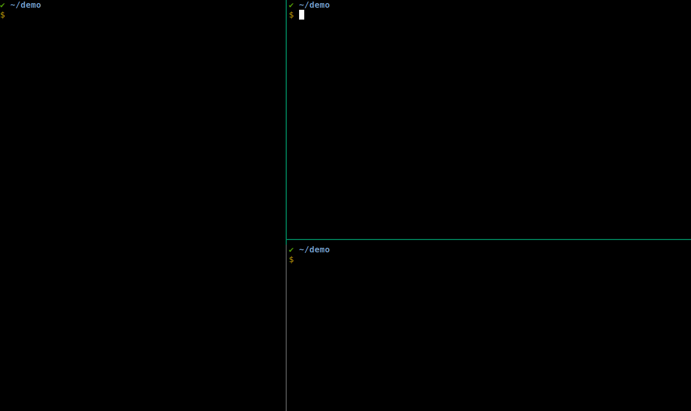

# niddle

niddle is a [nREPL](https://github.com/nrepl/nrepl) middleware that prints
eval-ed forms and their corresponding results onto stdout of the nREPL server
process. One use-case for this middleware is when the nREPL server is started
non-interactively on the cli, but you'd like to keep track of all that has been
eval-ed on the same CLI. (think [Cursive
REPL](https://cursive-ide.com/userguide/repl.html))



Colored pretty printing is done with [puget](https://github.com/greglook/puget).

## Usage

```edn
{...
 :aliases
 {:niddle {:extra-deps {org.clojure/clojure {:mvn/version "1.10.1"}
                        niddle {:git/url "https://github.com/pinealan/niddle.git" }}
           :main-opts ["-m" "nrepl.cmdline" "--middleware" "[niddle.print/print-eval]"]}
```

## Motivation
I really like the idea of having single REPL view that keeps track of all
eval-ed forms and values, no matter where they came from. This supports a
workflow where forms maybe sent from either CLI nREPL client, an editor, or even
a running process.

I've tried looking for tooling that gives this experience on vim+tmux setup, but
neither [vim-fireplace](https://github.com/tpope/vim-fireplace) nor
[vim-iced](https://github.com/liquidz/vim-iced) seem to provide that. In fact
since the goal is to show all eval-ed forms from any client, the intercept point
must be on the server-side, hence a nREPL middleware.
